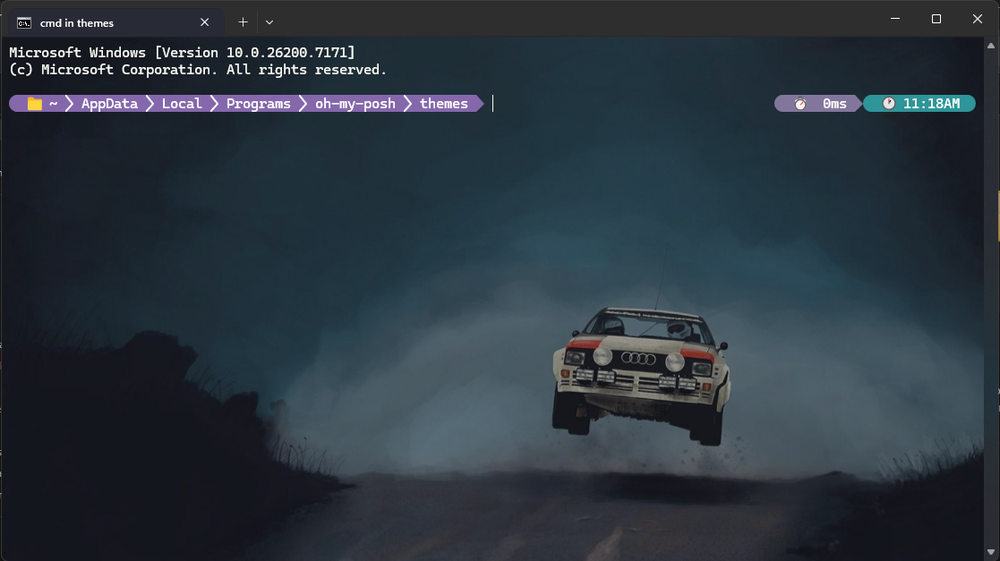
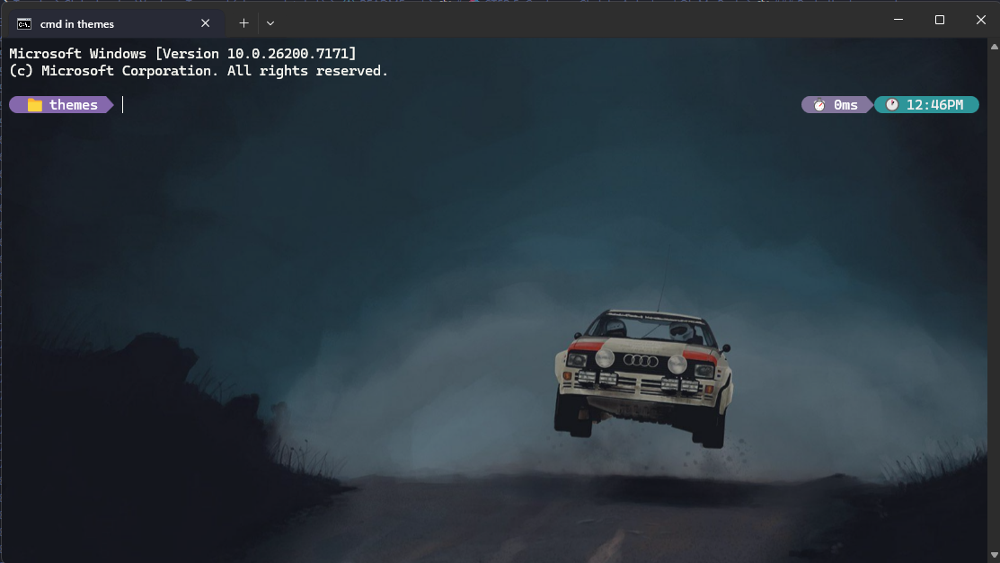

# Windows CMD Status Line Theme

## 🎯 Motivation

The motivation for this project came from the status line in Claude Code. I use Claude Code frequently and have my own custom status line script there. I wanted something similar for my personal Windows Terminal on my personal computer, but I couldn't find anything that would work with CMD.

I later discovered a [YouTube video](https://www.youtube.com/watch?v=-G6GbXGo4wo) showing Oh My Posh setup, but it was for PowerShell. I wanted it for my CMD/Terminal instead.

Using Claude.ai as my copilot, I found the best approach for Windows 11 and CMD, which led me to discover the Clink and Oh My Posh workaround.

So here I am sharing all the steps I took and my current theme. If anyone likes it, they can use it! I didn't create anything from scratch—everything was done with the help of Claude as my copilot.

---

## 📸 Screenshots

Here's how it looks:





If you like what you're seeing, here's the complete guide!

---

## 📚 References

- [Clink Documentation](https://chrisant996.github.io/clink/)
- [Oh My Posh Documentation](https://ohmyposh.dev/docs/)

---

## 📋 What You'll Get

- ✅ Oh My Posh prompt customization
- ✅ Clink (CMD enhancement for Oh My Posh support)
- ✅ Nerd Font (for icons: 📁, ⏱️, 🕐)
- ✅ My Custom `mantej-singh.json` theme
- ✅ Automatic startup configuration

---

## 📦 Prerequisites

- Windows 11 (may work on Windows 10)
- Internet connection
- Administrator access (for some steps)

---

## 🚀 Installation Guide

### 🎯 STEP 1: Install Oh My Posh

#### Open Command Prompt (or PowerShell)

Press `Win + R`, type `cmd`, press Enter

#### Install via Winget

```cmd
winget install JanDeDobbeleer.OhMyPosh -s winget
```

#### Close and reopen CMD to refresh environment variables

#### Verify installation

```cmd
oh-my-posh version
```

**Expected output:** Something like `Version: 19.x.x`

---

### 🎯 STEP 2: Install Clink (Required for CMD Support)

Oh My Posh doesn't work directly with plain CMD—it needs Clink.

#### Install Clink

```cmd
winget install clink
```

#### Close and reopen CMD

Clink will automatically inject itself into CMD sessions.

#### Verify Clink is active

```cmd
clink info
```

**Expected output:** Clink version info and session details

#### Hide Clink startup message (Optional)

Once Clink is installed, run this line:

```cmd
clink set clink.logo none
```

This will hide the Clink startup message.

- To see a shorter version: `clink set clink.logo short`
- To see the full message again: `clink set clink.logo full`

---

### 🎯 STEP 3: Install Nerd Font (For Icons)

#### Method 1: Quick Install via Oh My Posh (Recommended)

```cmd
oh-my-posh font install
```

**When prompted:**

1. Use arrow keys to select: **`MesloLGM Nerd Font`**
2. Press **Enter** to install
3. Wait for ""Font installed successfully""

#### Method 2: Manual Install

1. **Download:**
   - Go to: <https://www.nerdfonts.com/font-downloads>
   - Download: **""Meslo""** or **""CascadiaCode""**

2. **Extract the ZIP file**

3. **Install fonts:**
   - Select all `.ttf` files
   - Right-click → ""Install for all users""

#### Configure CMD to use Nerd Font

1. Right-click CMD title bar → **Properties**
2. Go to **Font** tab
3. Select: **MesloLGM Nerd Font** (or your installed font)
4. Click **OK**

#### If using Windows Terminal

Press `Ctrl + ,` to open settings, then add:

```json
{
  ""profiles"": {
    ""defaults"": {
      ""font"": {
        ""face"": ""MesloLGM Nerd Font"",
        ""size"": 10
      }
    }
  }
}
```

---

### 🎯 STEP 4: Create Your Custom Theme

#### Navigate to themes folder

```cmd
cd %LOCALAPPDATA%\Programs\oh-my-posh\themes
```

#### Create your theme file

```cmd
notepad mantej-singh.json
```

#### Paste the theme content

Copy the contents from [`themes/mantej-singh.json`](themes/mantej-singh.json) in this repository and paste into Notepad.

**Or download directly:** [Download mantej-singh.json](themes/mantej-singh.json)

Save the file (Ctrl + S) and close Notepad.

---

### 🎯 STEP 5: Configure Clink to Auto-Load Oh My Posh

#### Create/edit Clink startup script

```cmd
notepad %LOCALAPPDATA%\clink\oh-my-posh.lua
```

**If folder doesn't exist:**

```cmd
mkdir %LOCALAPPDATA%\clink
notepad %LOCALAPPDATA%\clink\oh-my-posh.lua
```

#### Paste this Lua script

```lua
load(io.popen('oh-my-posh init cmd --config ""' .. os.getenv('LOCALAPPDATA') .. '\\Programs\\oh-my-posh\\themes\\mantej-singh.json""'):read(""*a""))()
```

**Or download directly:** [Download oh-my-posh.lua](clink-scripts/oh-my-posh.lua)

Save the file (Ctrl + S) and close Notepad.

---

## 🎯 STEP 6: Test Your Setup

### Close and reopen CMD

You should see:

```cmd
📁 Screenshots                          ⏱️ 0ms 🕐 12:06PM
```

### Test with a command

```cmd
dir
```

After running, you'll see the execution time update:

```cmd
📁 Screenshots                          ⏱️ 125ms 🕐 12:06PM
```

---

## 🎨 Theme Customization

### Current Theme Features

- 📁 **Current folder name** (not full path)
- ⏱️ **Execution time** (how long the last command took)
- 🕐 **Current time** (12-hour format)

### Customize Your Theme

Edit your theme file:

```cmd
notepad %LOCALAPPDATA%\Programs\oh-my-posh\themes\mantej-singh.json
```

#### Change folder display style

In the JSON, find the `path` segment and modify:

```json
""properties"": {
  ""style"": ""folder"",     // Shows only current folder name
  ""home_icon"": "" .""      // Shows "" ."" for home directory
}
```

**Available styles:**

| Style | Example |
|-------|---------|
| `""folder""` | `Screenshots` |
| `""full""` | `C:\Users\mantej\Screenshots` |
| `""full""` + `""home_icon"": ""~""` | `~\Screenshots` |
| `""agnoster_short""` | `C: .. Screenshots` |

#### Change colors

Find these hex color codes in the JSON:

```json
""background"": ""#8568ac""  // Folder background (purple)
""background"": ""#83769c""  // Execution time background
""background"": ""#2e9599""  // Time background (teal)
```

Replace with your preferred colors!

---

## 🔧 Troubleshooting

### Problem: Oh My Posh not showing

**Solution:**

```cmd
clink info
```

Verify Clink is active. If not, reinstall Clink and restart CMD.

### Problem: Icons showing as boxes (□)

**Solution:**

- Nerd Font not installed correctly
- Re-run: `oh-my-posh font install`
- Make sure CMD is using the Nerd Font (see Step 3)

### Problem: Theme not loading

**Solution:**

```cmd
oh-my-posh init cmd --config ""%LOCALAPPDATA%\Programs\oh-my-posh\themes\mantej-singh.json""
```

Check for JSON syntax errors in your theme file.

### Problem: Clink Lua script not found

**Solution:**

```cmd
mkdir %LOCALAPPDATA%\clink
```

Then recreate the `oh-my-posh.lua` file (Step 5).

---

## 📝 Quick Reference Commands

### Update Oh My Posh

```cmd
winget upgrade JanDeDobbeleer.OhMyPosh
```

### Test theme immediately (without restart)

```cmd
oh-my-posh init cmd --config ""%LOCALAPPDATA%\Programs\oh-my-posh\themes\mantej-singh.json""
```

### Edit your theme

```cmd
notepad %LOCALAPPDATA%\Programs\oh-my-posh\themes\mantej-singh.json
```

### Reload Clink (after editing Lua script)

Close and reopen CMD.

---

## ✅ Installation Checklist

- [ ] Oh My Posh installed (`winget install JanDeDobbeleer.OhMyPosh`)
- [ ] Clink installed (`winget install clink`)
- [ ] Clink startup message hidden (`clink set clink.logo none`)
- [ ] Nerd Font installed (`oh-my-posh font install`)
- [ ] CMD configured to use Nerd Font
- [ ] `mantej-singh.json` theme created in Oh My Posh themes folder
- [ ] Clink Lua script created (`oh-my-posh.lua` in `%LOCALAPPDATA%\clink`)
- [ ] CMD restarted
- [ ] Prompt showing correctly with icons

---

## 📂 Repository Structure

```
windows-cmd-statusline/
├── README.md
├── themes/
│   └── mantej-singh.json
├── clink-scripts/
│   └── oh-my-posh.lua
└── Screenshots/
    └── style1.png
    └── style2.png
```

---

## 🙏 Credits

- **Oh My Posh:** [Jan De Dobbeleer](https://github.com/JanDeDobbeleer/oh-my-posh)
- **Clink:** [Christopher Antos](https://github.com/chrisant996/clink)
- **Nerd Fonts:** [Ryan L McIntyre](https://github.com/ryanoasis/nerd-fonts)
- **AI Assistant:** Claude.ai (Anthropic)
- **Inspiration:** Claude Code status line

---

## 📄 License

This project is provided as-is for personal and educational use. Feel free to modify and share!

---

## 🤝 Contributing

Found a bug or have a suggestion? Feel free to open an issue or submit a pull request!

---

## ⭐ Show Your Support

If you found this helpful, please star this repository! ⭐

---

**Enjoy your beautiful Wondows Terminal!** 🚀